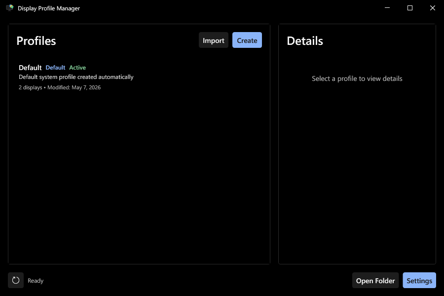
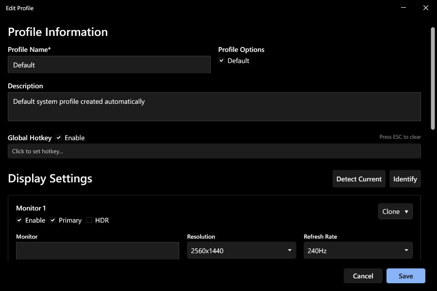
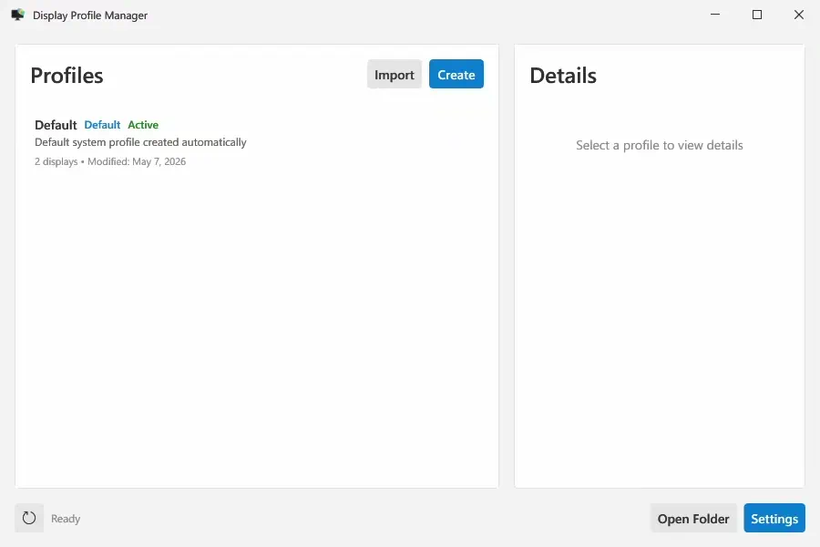

# Display Profile Manager

[](https://www.microsoft.com/windows)
[](https://dotnet.microsoft.com/download/dotnet-framework/net48)
[](LICENSE)
[](https://claude.ai/code)

A lightweight Windows desktop application for managing display profiles — save your monitor layout, resolution, refresh rate, HDR state, DPI, audio devices, and scripts into named profiles and switch between them on demand.

This is a fork based on [zac15987/DisplayProfileManager](https://github.com/zac15987/DisplayProfileManager). Distributed under MIT + Commons Clause.

---

## ✨ Features

**Profiles & switching**
- 🗂️ **Unlimited display profiles** — save any combination of monitor settings as a named profile
- 🖱️ **Multiple ways to switch** — GUI, global hotkey, system tray, or CLI
- 📺 **Full per-monitor control** — resolution, refresh rate, rotation, HDR, DPI, position, enable/disable, primary
- 🪞 **Mirror display support** — clone monitors in pure or mixed extended/mirror configurations
- 🖼️ **Custom profile icons** — assign a `.ico` icon to any profile; shown in the profile list, details panel, and system tray when active
- 📋 **Profile duplication** — copy an existing profile as a starting point
- 📥 **Import** — import `.dpm` profile files

**Automation**
- ⌨️ **Global hotkeys** — assign a keyboard shortcut to any profile for quick switching
- 🔊 **Audio device switching** — automatically switch default playback and recording devices with each profile
- 📜 **Script execution** — run `.exe`, `.ps1`, `.bat`, `.vbs`, `.js`, `.py`, or `.ahk` scripts automatically on profile apply
- 💻 **CLI support** — apply profiles, switch themes, and trigger refreshes from scripts or external tools
- 🚀 **Auto-start with Windows** — Registry mode (no admin) or Task Scheduler mode (faster, one-time admin setup)

**Themes**
- 🎨 **Built-in themes** — Light, Dark, Black, and System (follows Windows)
- 🖌️ **Custom themes** — import compatible `.xaml` theme files; they appear in the dropdown instantly on refresh
- 🛠️ **DPM Theme Builder** — included Python tool to generate themes from the [tinted-themes](https://github.com/tinted-theming/tinted-themes) database

---

## 🚀 Installation

1. Download the latest release from the [Releases](../../releases) page
2. Run `DisplayProfileManager.exe`
3. The application lives in your system tray
4. Your current display settings are automatically saved as the "Default" profile on first launch

**Requirements**
- Windows 10 version 1709 or later (Windows 7/8 unsupported — HDR, mirror displays, and some UI elements will not work correctly)
- [.NET Framework 4.8](https://dotnet.microsoft.com/en-us/download/dotnet-framework)
- No administrator rights required for normal use. Admin is only needed once for Task Scheduler auto-start mode setup.

---

## 📸 Screenshots

### Main Window


### Profile Editor


### Themes


---

## 📖 Documentation

- [Creating and Managing Profiles](./docs/wiki/profiles.md) — profiles, hotkeys, mirror displays, audio
- [Scripts](./docs/wiki/scripts.md) — supported types, execution, arguments, examples
- [Settings](./docs/wiki/settings.md) — set theme and UX behavior, see configured hotkeys and attributions
- [Themes & DPM Theme Builder](./docs/wiki/themes.md) — built-in themes, importing, generating custom themes
- [CLI Reference](./docs/wiki/cli.md) — all flags and usage examples
- [Reporting Issues](./docs/wiki/bug_report.md) — what to include when filing a bug report

---

## 🛠️ Development

See [CLAUDE.md](./CLAUDE.md) for architecture, display engine details, and development guidelines.

### Prerequisites
- Visual Studio 2019 or later
- .NET Framework 4.8 SDK

### Building

```bash
git clone https://github.com/exytral/DisplayProfileManager.git
cd DisplayProfileManager
nuget restore DisplayProfileManager.sln
powershell -File dev-build.ps1
```

---

## 📝 License

MIT + Commons Clause — see [LICENSE](LICENSE) for details. Third-party licenses: [THIRD-PARTY-LICENSES.md](THIRD-PARTY-LICENSES.md).

## 🙏 Acknowledgments

- [Newtonsoft.Json](https://www.newtonsoft.com/json) (BSD-3-Clause) — JSON serialization
- [NLog](https://nlog-project.org/) (MIT) — logging
- [windows-DPI-scaling-sample](https://github.com/lihas/windows-DPI-scaling-sample) (Unlicense) — DPI scaling foundation
- [tinted-themes](https://github.com/tinted-theming/tinted-themes) (MIT) — theme database for DPM Theme Builder
- [Claude Code](https://claude.ai/code) — built in collaboration with Anthropic's Claude Code

### 🤝 Contributors

**Upstream**
- [@zac15987](https://github.com/zac15987) (original project: display profiles, themes, system tray, auto-start, global hotkeys, initial audio device switching support — [v1.3.0](https://github.com/zac15987/DisplayProfileManager/releases/tag/v1.3.0))
- [@jarandal](https://github.com/jarandal) (initial HDR support, screen rotation — [PR #8](https://github.com/zac15987/DisplayProfileManager/pull/8))
- [@jonathanasdf](https://github.com/jonathanasdf) (initial clone display support — [PR #14](https://github.com/zac15987/DisplayProfileManager/pull/14))
- [@rvahilario](https://github.com/rvahilario) (partial clone fixes, clone UI, test infrastructure — [PR #23](https://github.com/zac15987/DisplayProfileManager/pull/23))
- [@xtrilla](https://github.com/xtrilla) (safe file saves — [fork](https://github.com/xtrilla/DisplayProfileManager))

**Community**
- [@Catriks](https://github.com/Catriks) — requested audio device switching ([#1](https://github.com/zac15987/DisplayProfileManager/issues/1))
- [@Alienmario](https://github.com/Alienmario) — suggested audio improvements and reported multi-monitor switching issues ([#1](https://github.com/zac15987/DisplayProfileManager/issues/1), [#5](https://github.com/zac15987/DisplayProfileManager/issues/5))
- [@anodynos](https://github.com/anodynos) — suggested global hotkeys for profile switching ([#2](https://github.com/zac15987/DisplayProfileManager/issues/2))
- [@xtrilla](https://github.com/xtrilla) — requested monitor enable/disable ([#4](https://github.com/zac15987/DisplayProfileManager/issues/4))