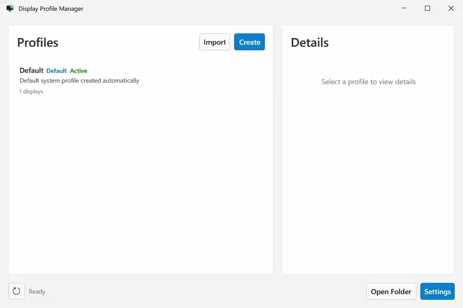

# Display Profile Manager

[](https://www.microsoft.com/windows)
[](https://dotnet.microsoft.com/download/dotnet/10.0)
[](LICENSE)

A lightweight Windows desktop application for managing display profiles — save the desktop layout, monitor settings, current wallpaper, audio devices, and helper scripts. Then, switch between presets on demand!



---

## ✨ Features

### 🖥️ Display Profiles

- 🗂️ **Unlimited display profiles** — save, edit, and switch desktop presets
- 📺 **Full per-monitor control** — configure enable/disable state, primary display, resolution, refresh rate, rotation, DPI, HDR/ACM, and color profile
- 🪞 **Flexible monitor layouts** — extend or clone displays in any combination
- 🛡️ **Apply failure recovery** — stop on display-configuration failure and safely roll back to the previous profile or a desktop snapshot
- 🖼️ **Custom profile icons** — assign a `.ico` icon to profiles, displayed in profile lists and menus

### 🖼️ Wallpaper

- 📷 **Wallpaper capture and apply** — save and restore Solid Color, per-monitor Pictures, Slideshow settings, and Windows Spotlight
- 🎛️ **Picture options** — adjust wallpaper fitment and background color
- ⚙️ **Slideshow options** — customize the source folder, interval, and shuffle/order
- 🔎 **Windows Spotlight** — capture and restore Spotlight wallpaper state

### 🔊 Audio & Scripts

- 🔊 **Audio device switching** — switch default playback and recording devices
- 📜 **Script execution** — run `.exe`, `.lnk`, `.ps1`, `.bat`/`.cmd`, `.vbs`/`.js`, `.py`, or `.ahk` scripts, with configurable launch arguments

### 🎨 Themes

- 🌗 **Built-in themes** — pick Light, Dark, and Black themes that follow the Windows accent color
- 🖌️ **Custom themes** — import compatible `.xaml` theme files with their own colors and accents

**🛠️ DPM Theme Builder** — included standalone Python tool for generating compatible `.xaml` themes from the [tinted-theming](https://github.com/tinted-theming/schemes) database

### ⚙️ Automation & Integration

- ⌨️ **Global hotkeys** — assign a keyboard shortcut to any profile for quick switching
- 📌 **System tray** — open the profile list from the taskbar to switch profiles
- 🖱️ **Desktop context menu** — apply profiles directly from the desktop classic right-click menu
- 💻 **CLI support** — automate profile switching and application control with scripts or external tools
- 🔔 **Optional update checking** — check GitHub for newer releases; no direct downloads or installation, and off by default

**🎮 DPM Shortcut Builder** — included standalone Python tool for creating game/app launch shortcuts that switch display profiles before launch and restore a selected profile on exit, with guided launcher integration for Steam, Epic Games, GOG Galaxy, Heroic, and Playnite

---

## 🌐 Related Projects

- [Icons Saver](https://github.com/KilluaZoldyck0099/Icons-Saver) (MIT) — save and restore Windows desktop icon layouts with display-aware positioning, a tray app, and a CLI
- [Microsoft PowerToys](https://github.com/microsoft/PowerToys) (MIT) — collection of Windows utilities, notably [Workspaces](https://learn.microsoft.com/en-us/windows/powertoys/workspaces) and [Power Display](https://learn.microsoft.com/en-us/windows/powertoys/power-display)
- [tinted-theming/schemes](https://github.com/tinted-theming/schemes) (MIT) — color schemes used by DPM Theme Builder

---

## 🚀 Installation

- **Installer** — use the latest installer from the [Releases](../../releases) page
- **Portable** — extract the portable archive from the [Releases](../../releases) page
- **WinGet** — run `winget install Exytral.DisplayProfileManager`

### Requirements

- [.NET 10 Desktop Runtime](https://dotnet.microsoft.com/download/dotnet/10.0)
- Windows 10 version 1709+

> HDR support requires Windows 10 version 1709+\
> ACM support on supported displays requires Windows 11 22H2+\
> Dedicated HDR/ACM API support requires Windows 11 24H2+

---

## 📖 Documentation

- [Creating and Managing Profiles](./docs/wiki/profiles.md) — profiles, displays, wallpaper, audio, scripts, and hotkeys
- [Scripts](./docs/wiki/scripts.md) — supported types, execution, arguments, configuration, and examples
- [Settings](./docs/wiki/settings.md) — application settings, startup, integrations, notifications, and hotkeys
- [Themes & DPM Theme Builder](./docs/wiki/themes.md) — built-in themes, custom themes, and theme generation
- [CLI & DPM Shortcut Builder](./docs/wiki/cli.md) — command-line flags, usage examples, and shortcut creation
- [Reporting Issues](./docs/wiki/bug_report.md) — what to include when filing a bug report

---

## 📝 License

MIT + Commons Clause — see [LICENSE](LICENSE) for details. Third-party licenses: [THIRD-PARTY-LICENSES.md](THIRD-PARTY-LICENSES.md).

## 🙏 Acknowledgments

- [Newtonsoft.Json](https://www.newtonsoft.com/json) (MIT) — JSON serialization
- [NLog](https://nlog-project.org/) (BSD-3-Clause) — Logging

### 🤝 Contributors

**This project**

- [@vivittel](https://github.com/vivittel) ([PR #1](https://github.com/vivittel/DisplayProfileManager/pull/1)) — Partial HDR and advanced color state detection fixes

**Upstream**

- [@zac15987](https://github.com/zac15987) ([Original Project](https://github.com/zac15987/DisplayProfileManager/releases)) — Display profiles, themes, system tray, auto-start, global hotkeys
- [@jarandal](https://github.com/jarandal) ([PR #8](https://github.com/zac15987/DisplayProfileManager/pull/8)) — Initial HDR support, screen rotation
- [@jonathanasdf](https://github.com/jonathanasdf) ([PR #14](https://github.com/zac15987/DisplayProfileManager/pull/14)) — Initial clone display support
- [@rvahilario](https://github.com/rvahilario) ([PR #23](https://github.com/zac15987/DisplayProfileManager/pull/23)) — Partial clone fixes, test infrastructure

**Community**

- [@Catriks](https://github.com/Catriks) ([#1](https://github.com/zac15987/DisplayProfileManager/issues/1)) — Requested audio device switching
- [@anodynos](https://github.com/anodynos) ([#2](https://github.com/zac15987/DisplayProfileManager/issues/2)) — Requested global hotkeys for profile switching
- [@xtrilla](https://github.com/xtrilla) ([#4](https://github.com/zac15987/DisplayProfileManager/issues/4)) — Requested monitor enable/disable configuration
- [@ffgtthr](https://github.com/ffgtthr) ([#2](https://github.com/zac15987/DisplayProfileManager/issues/2)) — Requested custom profile icons

---

## 🛠️ Development

See [AGENTS.md](./AGENTS.md) for architecture, display engine details, project structure, and development guidelines.

### Prerequisites

- Visual Studio 2022 or later
- .NET 10 SDK
- Desktop development with C++ workload for the shell extension

### Building

```bash
git clone https://github.com/exytral/DisplayProfileManager.git
cd DisplayProfileManager
powershell -File dev-build.ps1
```