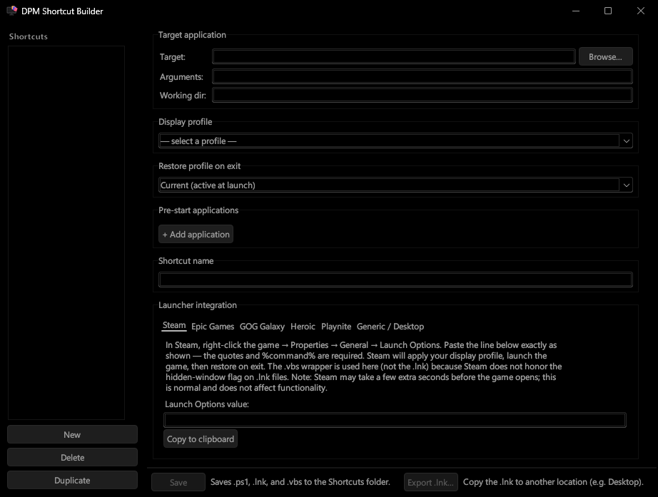

# CLI Reference

DPM accepts command-line arguments for profile application, theme switching, and refresh. Commands route to a running instance via named pipe when one is detected — a new process only fully starts if DPM is not already running.

> Looking to switch profiles automatically when launching a game or app? **[DPM Shortcut Builder](#dpm-shortcut-builder)** handles that without any manual scripting — jump to that section below.

---
Flags accept any number of leading dashes, or none at all:

```
DisplayProfileManager.exe --profile "Work"
DisplayProfileManager.exe -profile "Work"
DisplayProfileManager.exe profile "Work"
```

---

## Flags

### `--profile` "name/ID"

Apply a profile by name or ID. No argument reapplies the current active profile. When a running instance is detected, the command is forwarded via IPC and the invoking process exits.

```
DisplayProfileManager.exe --profile "TV Setup"
DisplayProfileManager.exe --profile # reapply current
```

### `--headless` "name/ID"

Apply a profile and exit — no window opens, no tray icon appears. DPM starts, applies the profile (or forwards to a running instance via IPC), and shuts down. If no instance is running, the profile is applied locally and DPM exits. This is the preferred flag for automation, scripts, and any context where you don't want DPM's UI appearing (e.g. while a game is running fullscreen).

```
DisplayProfileManager.exe --headless "TV Setup"
DisplayProfileManager.exe --headless # reapply current, headlessly
```

### `--theme` "name"

Switch to the named theme. Names with spaces require quotes. No name refreshes the current theme (requires a running instance).

```
DisplayProfileManager.exe --theme "Dark"
DisplayProfileManager.exe --theme "Light"
DisplayProfileManager.exe --theme # refresh current theme
```

If a running instance is found, the theme is applied live. If no instance is running and a name is provided, the setting is saved and takes effect on next launch.

### `--refresh`

Reload profiles and themes from disk. `--reload` and `-r` are accepted aliases. Useful after manually editing `.dpm` files or dropping new `.xaml` files into the themes folder. Requires a running instance — exits without effect if DPM is not running.

```
DisplayProfileManager.exe --refresh
```

### `--tray`

Start minimized to the system tray. No main window appears on launch. Exact match only.

```
DisplayProfileManager.exe --tray
```

### `--dev`

Bypass the single-instance check. Allows multiple copies to run simultaneously. For build scripts and development use only. Exact match only.

---

## Prefix matching

All flags except `--tray` and `--dev` support prefix abbreviation — any unambiguous prefix resolves to the full flag name:

```
--headless "Work"    ==    --head "Work"    ==    --h "Work"
--profile "Work"     ==    --prof "Work"    ==    --p "Work"
--theme "Dark"       ==    --t "Dark"
--refresh            ==    --ref            ==    -r
```

`--tray` and `--dev` require the exact, whole name (after stripping dashes).

---

## IPC behavior

When invoked, DPM first attempts to forward the command to a running instance over a named pipe. The invoking process exits on successful handoff.

Fallback when no instance is running:

- `--profile`, `--headless` — apply locally
- `--theme "Name"` — saves the setting, exits without live apply
- `--theme` (no name), `--refresh` — require a running instance; exit without effect if none found

Commands can be chained — applied in order:

```
DisplayProfileManager.exe --theme "Dark" --headless "Night Mode"
```

---

## Automation with `--headless`

`--headless` exits as soon as the apply completes or is handed off, making it safe for scheduled tasks, scripts, and shortcuts where a lingering DPM window would be unwanted.

### Apply a profile from Task Scheduler

- **Program:** `C:\Program Files\Display Profile Manager`
- **Arguments:** `--headless "Work"`
- **Trigger:** At log on, or on a schedule

### Apply a profile from PowerShell

```powershell
$dpm = "C:\Program Files\Display Profile Manager\DisplayProfileManager.exe"
& $dpm --headless "Work"
```

### Desktop shortcut for one-click switching

Set the shortcut target to:

```
"C:\Program Files\Display Profile Manager\DisplayProfileManager.exe" --headless "TV Setup"
```

### Chain a theme and profile switch

```
DisplayProfileManager.exe --theme "Dark" --headless "Night Mode"
```

---

## Steam Big Picture Mode watcher

`BigPictureMode.ps1` is a background script that tails Steam's `webhelper.txt` log and detects when Big Picture Mode opens or closes, then calls DPM with `--headless` to switch profiles automatically. Run it at Windows startup via `shell:startup` — it does not attach to a profile; it runs independently and calls DPM.

```powershell
$logFile = "${env:ProgramFiles(x86)}\Steam\logs\webhelper.txt"
$appPath = "C:\Program Files\Display Profile Manager\DisplayProfileManager.exe"
$global:BPM = $false

Write-Host "Monitoring Big Picture Mode state..." -ForegroundColor Cyan

Get-Content $logFile -Tail 0 -Wait -ErrorAction SilentlyContinue | ForEach-Object {
    $line = $_

    if ($line -match "SP BPM" -and $line -match "CreatingPopup" -and -not $global:BPM) {
        Write-Host "[$(Get-Date)] Big Picture Mode: ON" -ForegroundColor Green
        Start-Process $appPath -ArgumentList '--headless "TV Setup"'
        $global:BPM = $true
    }
    elseif ($line -match "SP Desktop" -and $line -match "CreatingPopup" -and $global:BPM) {
        Write-Host "[$(Get-Date)] Big Picture Mode: OFF" -ForegroundColor Red
        Start-Process $appPath -ArgumentList '--headless "Desktop"'
        $global:BPM = $false
    }
}
```

**Setup via Task Scheduler:**

**Setup via `shell:startup`:**

1. Create a new shortcut (right-click desktop → New → Shortcut).
2. Set the target to:
```
powershell.exe -WindowStyle Hidden -ExecutionPolicy Bypass -File "%AppData%\Roaming\DisplayProfileManager\Scripts\BigPictureMode.ps1"
```
3. Name it anything (e.g. "BigPictureMode") and finish.
4. Press Win+R, type `shell:startup`, and drop the shortcut in.

Update `$appPath` and the profile names to match your setup. The script maintains its own BPM state (`$global:BPM`) to avoid redundant triggers.

> For the version that *launches* Big Picture Mode as part of a profile switch rather than watching for it, see [Scripts — Launch Steam Big Picture Mode on profile apply](./scripts.md#launch-steam-big-picture-mode-on-profile-apply).

---

## DPM Shortcut Builder

DPM Shortcut Builder (`DPMShortcutBuilder.pyw`) is a standalone Python tool for creating game and app launch shortcuts that automatically switch your display profile before launch and restore it on exit.

**Requirements:** Python 3.8+ with Tkinter (standard on Windows). `pywin32` is required for `.lnk` generation — `pip install pywin32`.

> The standalone `DPMShortcutBuilder.exe` bundles all dependencies and does not have requirements.



**Workflow:**

1. Click **New** and set your **Target** application — browse to an `.exe`, `.lnk`, or any supported script type. The working directory is populated automatically from the target's location.
2. Select a **Display profile** to switch to before the app launches.
3. Select a **Restore profile on exit** — defaults to the profile active at launch time, or pick any saved profile.
4. Optionally add **Pre-start applications** — scripts or executables to run after the profile switch but before the target launches. Each entry supports custom arguments, a **Kill on exit** toggle, and a configurable delay (up to 10.0s).
5. Give the shortcut a name, then click **Save** — the shortcut is stored to `%AppData%\DisplayProfileManager\Shortcuts\<name>\`. Click **Export .lnk…** to copy the `.lnk` to any location.

**Launcher integration:** The **Launcher integration** panel at the bottom provides ready-to-paste launch option strings for Steam, Epic Games, GOG Galaxy, Heroic, Playnite, and Generic / Desktop shortcuts, so the native play button in your launcher uses the shortcut automatically.

> **Note:** A target application and selected display profile is required to Save a shortcut.