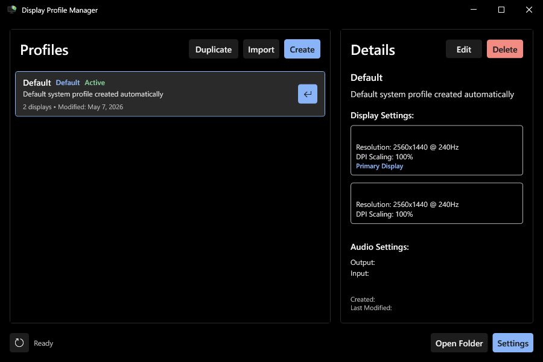
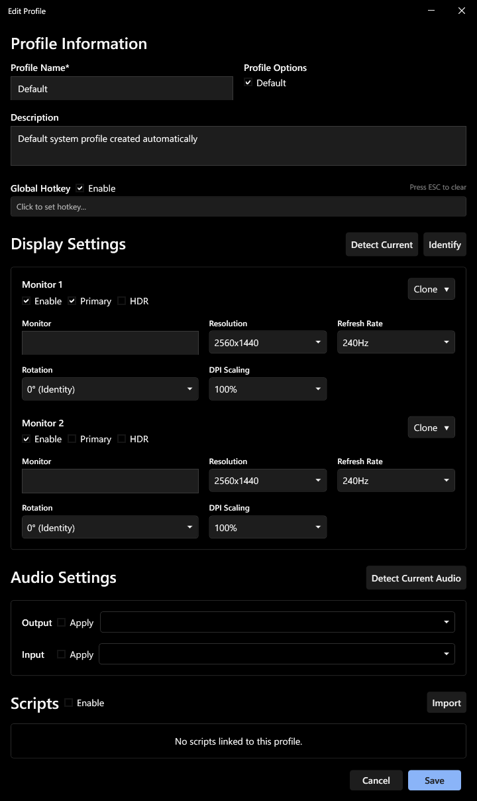

# Creating and Managing Profiles

Profiles store a complete snapshot of your display setup — monitor layout, resolution, refresh rate, rotation, HDR state, and DPI scaling — as well as audio devices and scripts. Switch between them from the GUI, system tray, a global hotkey, or the command line.

---

## Creating a profile

On first launch, DPM saves your current display configuration as the **Default** profile. To create additional profiles, click **Create** in the main window. The profile editor opens immediately — give the profile a name, configure its settings, then click **Save**.

To snapshot your current display configuration automatically, click **Detect Current** inside the editor. To capture your current audio devices, click **Detect Current Audio** in the Audio Settings section.

**Duplicating a profile** — select a profile in the main window, then click **Duplicate** in the toolbar. The editor opens immediately with a copy. Rename and adjust before saving.

---

## Per-monitor settings

The profile editor shows one panel per detected monitor under **Display Settings**. Each panel exposes:

- **Enable** — include or exclude this monitor from the profile. Disabled monitors appear greyed out in the Details panel with an amber "Disabled Monitor" badge.
- **Primary** — designate which monitor Windows treats as the primary display
- **HDR** — enable or disable HDR for this monitor
- **Resolution** — width × height
- **Refresh Rate** — in Hz
- **Rotation** — 0°, 90°, 180°, 270°
- **DPI Scaling** — percentage scale applied for this display

Click **Identify** to briefly overlay each physical screen with its number. Click **Detect Current** at any time to overwrite all stored display settings with your live configuration.

---

## Mirror/clone display configuration

To mirror (show identical content on two or more monitors), click the **Clone** dropdown on any monitor panel and select which monitor to clone with. The two monitors merge into a single group panel showing both device names, with **Break Clone** replacing the Clone dropdown.

To undo a mirror group, click **Break Clone** on the group panel. This splits the monitors back into independent panels.

Clone groups can coexist with extended displays in the same profile. For example, two monitors can be mirrored while a third extends independently.

> Windows ultimately determines the shared resolution and refresh rate for a clone group — the OS may override manual settings to ensure compatibility between grouped monitors.

---

## Audio device switching

Expand **Audio Settings** in the profile editor. Each row has an **Apply** toggle — enable it to switch to that device when the profile is applied, or leave it off to make no change.

- **Output** — default playback device
- **Input** — default recording device

If a configured device is absent when the profile is applied, that audio step is skipped and the rest of the profile applies normally.

---

## Scripts

Each profile can run one or more scripts automatically after the display, DPI, and audio settings have been applied. Common uses: launching an app, switching a smart device, killing a background process.

In the profile editor, scroll to **Scripts** and click **Import** to add a script. Scripts are sandboxed — they are copied into DPM's scripts folder on import. Arguments can be typed into the field next to each script entry.

To remove a script, click its delete button — the script is greyed out and the icon changes to a revert symbol. The deletion is committed when you save the profile. The file itself remains in the scripts folder and can be re-added later.

The **Enable** toggle in the Scripts section header controls whether any scripts run at all for this profile. Disabling the section does not remove the scripts — they remain stored and will run again when re-enabled.

> See [Scripts](./scripts.md) for supported file types, argument handling, and full examples.

---

## Global hotkeys

Assign a keyboard shortcut to any profile so you can switch without UI interactions.

1. In the profile editor, check **Enable** next to **Global Hotkey**.
2. Click the hotkey field and press your desired key combination. Press **Esc** to clear.
3. Save the profile.

Hotkeys are system-wide and active as long as DPM is running. They are temporarily disabled while any profile editor window is open. All configured hotkeys are visible under **Settings → Global Hotkeys**.

---

## Applying a profile

There are several ways to apply a profile:

- **Hover a profile card** and click the `←` button — applies immediately without selecting the profile first
- **Double-click an unselected card** — selects and applies
  - (**Double-clicking a selected card** opens the profile editor instead)
- **System tray** — click any profile name in the tray menu to apply directly
- **Global hotkey** — applies from anywhere without opening DPM
- **Command line** — see [CLI Reference](./cli.md)

Applying a profile clears the current selection in the main window.

---

## Importing a profile

DPM profiles are stored as `.dpm` files. To import one, click **Import** in the main window and select the file. Imported profiles appear in the list immediately.

Profile files are hardware-specific — they store each display's EDID information (manufacturer, product code, serial number) alongside its settings. A profile shared from another machine will still load but most likely fail to properly apply.

Profile files are stored at `%AppData%\Roaming\DisplayProfileManager\Profiles\`.
