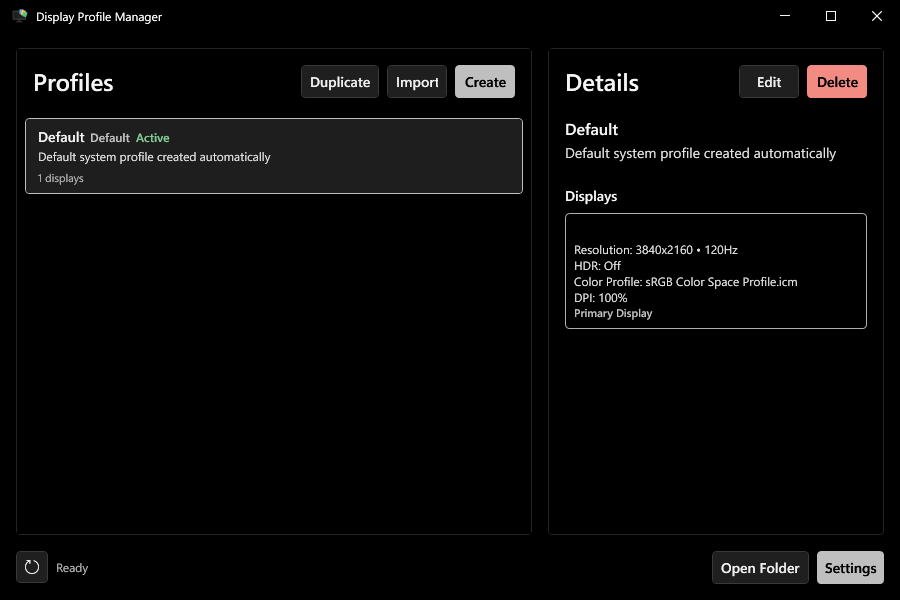
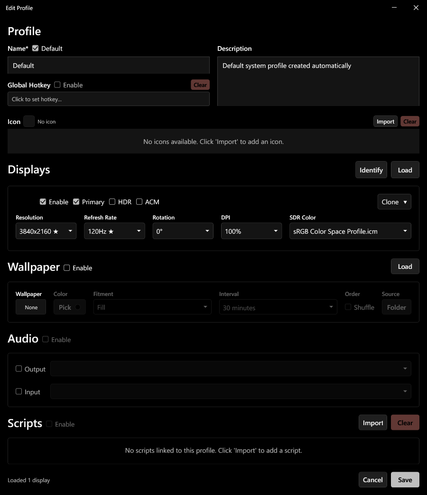

# Creating and Managing Profiles

Profiles store display settings such as monitor layout, resolution, refresh rate, rotation, HDR/ACM state, and DPI scaling. A profile can also store wallpaper, audio, scripts, and a global hotkey.

---

## Creating a profile

New profiles open with the current live display configuration already loaded. Click **"Create"** in the main window, adjust the settings, give the profile a name, and click **"Save"**.

**"Load"** recaptures the current display configuration into an existing editor session.

**Duplicating a profile** — select a profile in the main window, click **"Duplicate"**, then adjust the copy before saving.



---

## Per-monitor settings

The profile editor shows one panel per detected monitor under **Display Settings**. Each panel can expose:

- **Enable** — include or exclude the monitor from the profile
- **Primary** — designate the primary display
- **HDR** — desired HDR state on HDR-capable displays
- **ACM** — desired Auto Color Management state where supported
- **Resolution** — width × height
- **Refresh Rate** — desired refresh rate in Hz
- **Rotation** — Not Applied, 0°, 90°, 180°, or 270°
- **DPI** — desired Windows scaling percentage
- **SDR/HDR Color** — ICC/ICM color profile association

Click **"Identify"** to briefly overlay each physical monitor with its number.

Click **"Load"** to replace the current editor display settings with the live display configuration.



---

## Mirror/clone display configuration

To mirror two displays, use the **"Clone"** control on a display and select another display. The initiating monitor becomes the clone source and supplies the shared clone configuration.

The grouped displays share the relevant display controls. The source is labeled **(Source)** and the attached display **(Clone)**. **"Break Clone"** splits the group again.

When a clone is broken, attached members restore their saved pre-clone display state. If saved pre-clone state is unavailable, the attached member uses the fallback restoration behavior.

Clone groups can coexist with independent extended displays in the same profile.

---

## Wallpaper

When **Enable Wallpaper** is active, the profile applies its saved Windows wallpaper state.

| Mode           | Stored state                                         |
| -------------- | -----------------------------------------------------|
| **Solid Color**| Background color                                     |
| **Picture**    | Per-monitor image path and fitment                   |
| **Slideshow**  | Fitment, interval, shuffle state, and source folder  |
| **Spotlight**  | Spotlight-enabled state                              |

The profile editor shows a wallpaper preview and provides mode-specific controls. **Solid Color** and **Picture** include a color picker, while **Picture** also provides fitment options. **Slideshow** provides fitment, interval, shuffle/order, and source-folder controls. **Spotlight** provides a preview only.

## Audio

## Audio

When **Enable Audio** is active, the profile applies its configured playback and recording devices. Each playback or recording row has an **Apply** setting that controls whether that endpoint changes when the profile runs.

The device dropdown menus enumerate currently available devices when opened. A saved device that is no longer available remains selected until another device is chosen, and is shown as **Unavailable** in the editor and Details panel. Closing the dropdown without selecting another device preserves the saved endpoint, which can still be saved with the profile.

---

## Scripts

When **Enable Scripts** is active, the profile runs its enabled scripts after the display, wallpaper, and audio stages. Imported scripts are copied into the application's sandboxed scripts folder.

Each script has its own enable checkbox. Disabling a row keeps the script, its file, and its arguments in the profile but skips that script during apply.

The **"Enable"** toggle in the Scripts section header controls whether the script section runs at all. Disabling the section does not remove its stored scripts.

> See [Scripts](./scripts.md) for supported file types, arguments, and examples.

---

## Global hotkeys

Assign or clear a system-wide hotkey from a profile from the profile editor. Hotkeys are temporarily disabled while a profile editor window is open. Configured hotkeys are listed under **Settings → Global Hotkeys**.

---

## Profile icons

Each profile can have a custom `.ico` icon. Imported icons are copied into the application's icon sandbox and can be selected from the profile editor.

Click **"Clear"** to remove the icon assignment without deleting the underlying imported icon file.

---

## Applying a profile

A profile can be applied from several places:

- the **Apply** button on a profile card;
- double-clicking an unselected profile card;
- the system tray menu;
- the desktop context menu when the shell extension is enabled;
- a configured global hotkey;
- the command line.

Double-clicking an already selected profile opens the profile editor.

> See [CLI Reference](./cli.md) for command-line application.

---

## Importing a profile

Profiles are stored as `.dpm` files. Use **"Import"** in the main window to select a profile file.

Profiles contain display identity information and are therefore hardware-specific. A profile from another machine can load, but it may not map cleanly to the current displays.

The application uses stored target and EDID identity information when resolving displays. A display that has moved to another output can still be matched through its panel identity when available. During profile application, display availability is evaluated separately from the active-path state so that a temporarily missing active path does not automatically mean the display is physically disconnected.

Profile files are stored at:

```text
%AppData%\Roaming\DisplayProfileManager\Profiles\
```