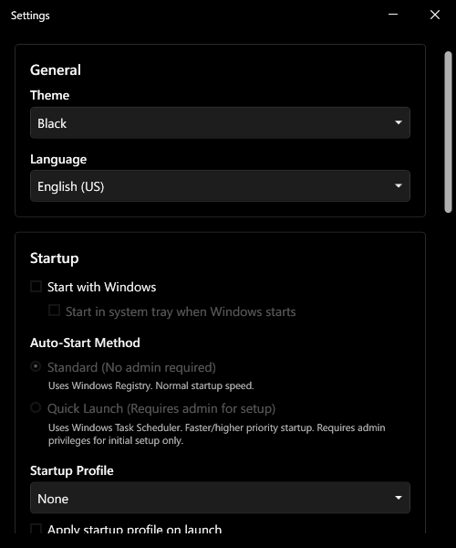

# Settings

Open Settings from the **Settings** button in the main window, or via **Settings...** in the system tray menu.

---

## Theme

Select a theme from the dropdown. The change applies immediately. Built-in options are Light, Dark, Black, and System (follows Windows light/dark mode). Any custom themes you have installed appear below the built-ins.

> See [Themes](./themes.md) for importing custom themes and using DPM Theme Builder.

---

## Start with Windows

Enables DPM to launch automatically at login. When enabled, **Start in system tray when Windows starts** becomes available — check it to skip the main window and go straight to the tray on startup.

Unchecking **Start with Windows** also unchecks the tray sub-option automatically.

**Auto-Start Method** — two modes are available:

- **Standard (No admin required)** — registers DPM in the Windows Registry (`HKCU\...\Run`). Normal startup speed. No admin rights needed.
- **Quick Launch (Requires admin for setup)** — registers a Task Scheduler task. Faster and higher priority startup. Admin is required once during setup; normal launches afterward do not need it.

---

## Startup Profile

Choose a profile to apply when DPM starts, and check **Apply startup profile on launch** to enable it. This is independent of the **Default** badge shown on profile cards — you can set freely any profile as the startup profile.

---

## Window Behavior

Controls what happens when you close the main window:

- **Minimize to system tray** — DPM stays running in the background (default)
- **Exit application** — DPM shuts down completely

Check **Remember my choice** to suppress the prompt and always use the selected behavior.

---

## Notifications

**Show notifications when profiles are applied** — toggles Windows toast notifications that appear each time a profile is applied through the tray or hotkeys. On by default.

---

## Global Hotkeys

A read-only list of all hotkeys configured across your profiles, showing which profile each is assigned to and whether it is currently enabled. To add or change a hotkey, open the profile editor for the relevant profile.

---

## About

Shows the current version number, the path to your settings file, contributor acknowledgements, and third-party library licenses.