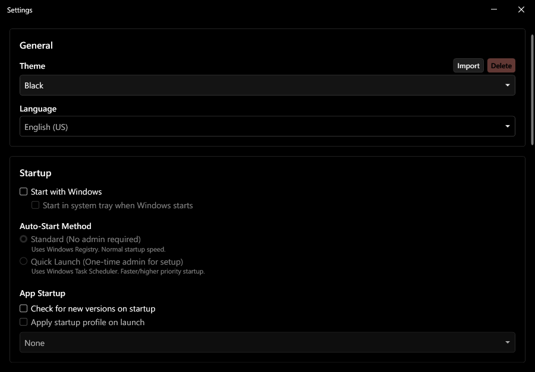

# Settings

Open Settings from the **"Settings"** button in the main window or in the system tray menu.

---

## Theme

Select a theme from the dropdown. The change applies immediately.

The built-in theme options are **Light**, **Dark**, **Black**, and **System**. System follows the Windows light/dark setting, and the packaged visual themes use the Windows accent color.

> See [Themes](./themes.md) for custom theme files and DPM Theme Builder.

---

## Start with Windows

Enable **"Start with Windows"** to launch Display Profile Manager automatically when you sign in. When enabled, **"Start in system tray when Windows starts"** becomes available.

**Auto-Start Method** offers two modes:

- **Standard (No admin required)** — uses the per-user Registry startup entry.
- **Quick Launch (Requires admin for setup)** — uses Task Scheduler and requires administrator approval during setup.

When an elevated Task Scheduler operation is canceled, Settings restores the previous auto-start state and shows a warning. Other failures show an error and restore the previous state.

---

## App Startup

Configure actions that occur when Display Profile Manager launches.

- **Check for updates on startup** — off by default. When enabled, Display Profile Manager checks GitHub for a newer release immediately and at startup. Newer releases are shown in the status bar, About section, and Windows notifications after the seven-day age threshold.
- **Startup Profile** — apply a selected profile when Display Profile Manager starts.

Update checking is not continuously polled. Display Profile Manager checks release metadata only; it does not download, install, or execute updates.

---

## Window Behavior

Choose what happens when the main window closes:

- **Minimize to system tray** — keep Display Profile Manager running in the background.
- **Exit application** — shut Display Profile Manager down immediately.

**"Remember my choice"** suppresses the close prompt and always uses the selected behavior.

**"Show notifications when profiles are applied"** controls Windows toast notifications for supported profile-apply entry points.

**"Add profile switcher to desktop right-click menu"** registers the native shell extension as a per-user integration. The extension applies profiles through the `--headless` command path.

---

## Display Recovery

Display recovery settings control what happens when a display-configuration stage fails. All three recovery settings are enabled by default.

- **Abort the profile application if display configuration fails** — stop the profile pipeline when a display stage fails instead of continuing through DPI, wallpaper, audio, and scripts.
- **Rollback after an aborted display application** — perform recovery after an aborted display apply.
- **Reapply the previous profile** — use the previously active profile when one exists; otherwise fall back to the pre-apply display snapshot.
- **Restore the pre-apply snapshot** — use the pre-apply snapshot directly. Snapshot rollback restores display state only and does not leave a profile marked active.

---

## Global Hotkeys

A read-only list shows configured profile hotkeys and their current enabled state. Edit a profile to add or change its hotkey.

---

## About

Shows the current application version, settings-file path, dependency metadata, and contributors.