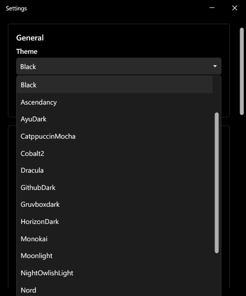
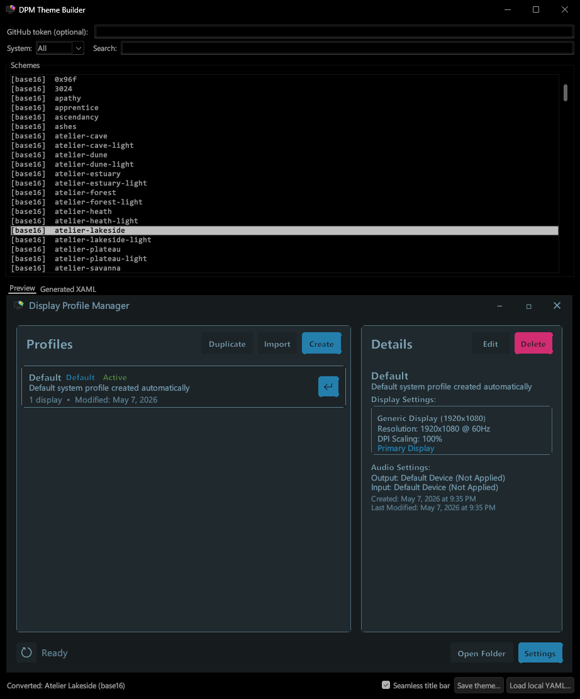

# Themes

DPM ships with three  built-in themes and supports importing custom `.xaml` theme files. The easiest way to generate a custom theme is with the included DPM Theme Builder.

---

## Built-in themes

| Theme | Description |
|---|---|
| **Light** | Light grey backgrounds, blue accent |
| **Dark** | Dark grey backgrounds, blue accent |
| **Black** | True black backgrounds, suitable for OLED or high-contrast preference |
| **System** | Follows your Windows light/dark mode setting automatically |

---

## Switching themes

Open **Settings** and select a theme from the **Theme** dropdown. The change applies immediately.



> You can also switch themes from the command line — see [CLI Reference](./cli.md).

---

## DPM Theme Builder

DPM Theme Builder (`DPMThemeBuilder.pyw`) is a standalone Python tool that converts color schemes from the [tinted-themes](https://github.com/tinted-theming/tinted-themes) database (Base16 and Base24) into DPM-compatible `.xaml` files.

**Requirements:** Python 3.8+ with Tkinter (included by default on Windows). No third-party packages required. Optionally install `pyyaml` (`pip install pyyaml`) for more robust YAML parsing — the built-in fallback handles most schemes, but `pyyaml` is more reliable with unusual formatting or non-ASCII characters in scheme files.



**Workflow:**

1. The tool fetches the full scheme list from GitHub on launch. Use the search box or the Base16/Base24 filter to find a scheme.
2. Click a scheme name to generate the XAML and update the preview.
3. Toggle **Seamless title bar** to blend or differentiate the title bar and window background.
4. Click **Save theme…** — the dialog opens to `%AppData%\Roaming\DisplayProfileManager\Themes\` by default. Save there and and the theme will automatically apply.

You can also click **Load local YAML…** to convert a Base16/Base24 YAML file without fetching from GitHub.

**GitHub token (optional):** The unauthenticated GitHub API allows 60 requests per hour. If you hit this limit (only likely when browsing many schemes at once), paste a GitHub personal access token into the token field at the top of the window. The token only needs public repo read access and is not stored by the tool.

> The preview panel is a simplified canvas render, not a live WPF window. The saved `.xaml` is always accurate — check it applied in DPM for the real result.

---

## Importing a theme manually

Use the **Import** button to drop any compatible `.xaml` file into:

```
%AppData%\Roaming\DisplayProfileManager\Themes\
```

And the theme will automatically apply. (Adding through file explorer requires a manual reload event — click **Refresh** in DPM or run `DisplayProfileManager.exe --refresh`.)

---

## Theme file compatibility

A compatible theme file is a WPF `ResourceDictionary` that defines all required brush and effect keys. The six keys required for a valid import are: `WindowBackgroundBrush`, `PrimaryTextBrush`, `ContentBackgroundBrush`, `BorderBrush`, `ButtonBackgroundBrush`, and `ButtonForegroundBrush`. All remaining keys are expected for correct rendering — missing ones fall back to defaults silently.

Use this template as a starting point. Replace the placeholder hex values with your palette:

```xml
<ResourceDictionary xmlns="http://schemas.microsoft.com/winfx/2006/xaml/presentation"
                    xmlns:x="http://schemas.microsoft.com/winfx/2006/xaml">

    <!-- Base Colors -->
    <Color x:Key="BackgroundColor">#YOUR_BG</Color>
    <Color x:Key="SurfaceColor">#YOUR_SURFACE</Color>
    <Color x:Key="BorderColor">#YOUR_BORDER</Color>
    <Color x:Key="HoverColor">#YOUR_HOVER</Color>
    <Color x:Key="AccentColor">#YOUR_ACCENT</Color>

    <!-- Window Backgrounds -->
    <SolidColorBrush x:Key="WindowBackgroundBrush" Color="{StaticResource BackgroundColor}"/>
    <SolidColorBrush x:Key="TitleBarBackgroundBrush" Color="{StaticResource BackgroundColor}"/>
    <SolidColorBrush x:Key="AlternateBackgroundBrush" Color="#YOUR_ALT_BG"/>

    <!-- Content & Control Backgrounds -->
    <SolidColorBrush x:Key="ContentBackgroundBrush" Color="{StaticResource SurfaceColor}"/>
    <SolidColorBrush x:Key="ControlBackgroundBrush" Color="{StaticResource SurfaceColor}"/>
    <SolidColorBrush x:Key="TextBoxBackgroundBrush" Color="{StaticResource SurfaceColor}"/>
    <SolidColorBrush x:Key="ComboBoxBackgroundBrush" Color="{StaticResource SurfaceColor}"/>
    <SolidColorBrush x:Key="ComboBoxDropDownBackgroundBrush" Color="{StaticResource SurfaceColor}"/>
    <SolidColorBrush x:Key="CheckBoxBackgroundBrush" Color="{StaticResource SurfaceColor}"/>
    <SolidColorBrush x:Key="ListItemBackgroundBrush" Color="{StaticResource SurfaceColor}"/>

    <!-- Borders & Separators -->
    <SolidColorBrush x:Key="BorderBrush" Color="{StaticResource BorderColor}"/>
    <SolidColorBrush x:Key="SeparatorBrush" Color="#YOUR_SEPARATOR"/>
    <SolidColorBrush x:Key="ControlBorderBrush" Color="{StaticResource BorderColor}"/>
    <SolidColorBrush x:Key="TextBoxBorderBrush" Color="{StaticResource BorderColor}"/>
    <SolidColorBrush x:Key="ComboBoxBorderBrush" Color="{StaticResource BorderColor}"/>
    <SolidColorBrush x:Key="CheckBoxBorderBrush" Color="{StaticResource BorderColor}"/>
    <SolidColorBrush x:Key="WindowControlHoverBrush" Color="{StaticResource BorderColor}"/>
    <SolidColorBrush x:Key="ListItemSelectedBackgroundBrush" Color="{StaticResource BorderColor}"/>

    <!-- Interaction States -->
    <SolidColorBrush x:Key="ControlHoverBackgroundBrush" Color="{StaticResource HoverColor}"/>
    <SolidColorBrush x:Key="ListItemHoverBackgroundBrush" Color="{StaticResource HoverColor}"/>
    <SolidColorBrush x:Key="ComboBoxHoverBackgroundBrush" Color="{StaticResource HoverColor}"/>
    <SolidColorBrush x:Key="ControlPressedBackgroundBrush" Color="#YOUR_PRESSED"/>

    <!-- Primary Button (Accent) -->
    <SolidColorBrush x:Key="ButtonBackgroundBrush" Color="{StaticResource AccentColor}"/>
    <SolidColorBrush x:Key="ButtonForegroundBrush" Color="White"/>
    <SolidColorBrush x:Key="ButtonHoverBackgroundBrush" Color="#YOUR_ACCENT_HOVER"/>
    <SolidColorBrush x:Key="ButtonPressedBackgroundBrush" Color="#YOUR_ACCENT_PRESSED"/>
    <SolidColorBrush x:Key="ButtonBorderBrush" Color="{StaticResource AccentColor}"/>
    <SolidColorBrush x:Key="TextBoxFocusBorderBrush" Color="{StaticResource AccentColor}"/>
    <SolidColorBrush x:Key="CheckBoxCheckmarkBrush" Color="{StaticResource AccentColor}"/>
    <SolidColorBrush x:Key="LinkBrush" Color="{StaticResource AccentColor}"/>

    <!-- Secondary Button -->
    <SolidColorBrush x:Key="SecondaryButtonBackgroundBrush" Color="#YOUR_SEC_BG"/>
    <SolidColorBrush x:Key="SecondaryButtonForegroundBrush" Color="#YOUR_SEC_FG"/>
    <SolidColorBrush x:Key="SecondaryButtonHoverBackgroundBrush" Color="#YOUR_SEC_HOVER"/>
    <SolidColorBrush x:Key="SecondaryButtonPressedBackgroundBrush" Color="#YOUR_SEC_PRESSED"/>
    <SolidColorBrush x:Key="SecondaryButtonBorderBrush" Color="#YOUR_SEC_BORDER"/>

    <!-- Status Buttons -->
    <SolidColorBrush x:Key="DangerButtonBackgroundBrush" Color="#YOUR_DANGER"/>
    <SolidColorBrush x:Key="DangerButtonHoverBackgroundBrush" Color="#YOUR_DANGER_HOVER"/>
    <SolidColorBrush x:Key="SuccessButtonBackgroundBrush" Color="#YOUR_SUCCESS"/>
    <SolidColorBrush x:Key="SuccessButtonHoverBackgroundBrush" Color="#YOUR_SUCCESS_HOVER"/>

    <!-- Title Bar -->
    <SolidColorBrush x:Key="TitleBarTextBrush" Color="#YOUR_TITLEBAR_TEXT"/>
    <SolidColorBrush x:Key="CloseButtonHoverBrush" Color="#E81123"/>

    <!-- Text -->
    <SolidColorBrush x:Key="PrimaryTextBrush" Color="#YOUR_PRIMARY_TEXT"/>
    <SolidColorBrush x:Key="SecondaryTextBrush" Color="#YOUR_SECONDARY_TEXT"/>
    <SolidColorBrush x:Key="TertiaryTextBrush" Color="#YOUR_TERTIARY_TEXT"/>

    <!-- Tooltips -->
    <SolidColorBrush x:Key="TooltipBackgroundBrush" Color="#YOUR_TOOLTIP_BG"/>
    <SolidColorBrush x:Key="TooltipTextBrush" Color="#YOUR_TOOLTIP_TEXT"/>

    <!-- Effects -->
    <DropShadowEffect x:Key="CardShadow" ShadowDepth="2" Direction="270" BlurRadius="8" Opacity="0.15" Color="Black"/>
    <DropShadowEffect x:Key="ButtonShadow" ShadowDepth="1" Direction="270" BlurRadius="4" Opacity="0.1" Color="Black"/>

</ResourceDictionary>
```
