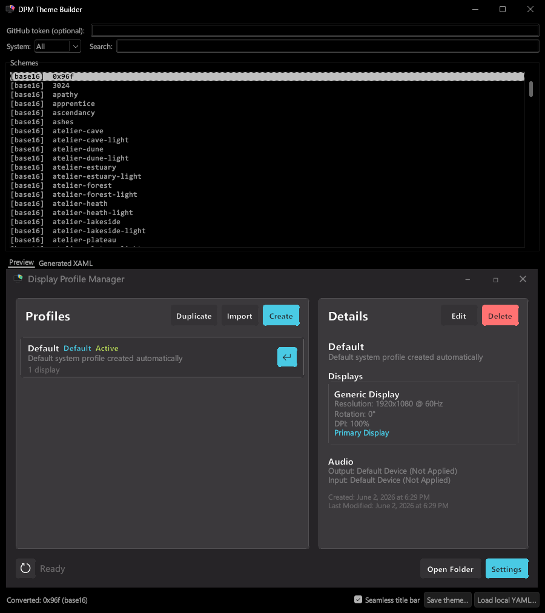

# Themes

Display Profile Manager ships with three packaged visual themes and a **"System"** theme option, and supports importing custom `.xaml` theme files. **DPM Theme Builder** can generate compatible themes from Base16 and Base24 schemes.

---

## Built-in theme options

| Theme option | Description                                        |
| ------------ | -------------------------------------------------- |
| **System**   | Follows the Windows light/dark setting             |
| **Light**    | Light theme with Windows accent integration        |
| **Dark**     | Neutral dark theme with Windows accent integration |
| **Black**    | Black theme with Windows accent integration        |

---

## Switching themes

Open **"Settings"** and select a theme from the **Theme** dropdown. The change applies immediately.

> You can also switch themes from the command line — see [CLI Reference](./cli.md).

---

## Importing a theme

Use **"Import"** in the main or settings window to select a compatible `.xaml` theme file. Display Profile Manager validates the file before copying it into:

```text
%AppData%\Roaming\DisplayProfileManager\Themes\
```

A successfully imported theme is loaded, applied immediately, and selected as the current theme.

Files placed directly into the themes folder are discovered when the theme list is initialized or refreshed. Direct file drops do not go through the import validation step.

### Required keys

Display Profile Manager requires these six resource keys when loading a custom theme:

- `WindowBackgroundBrush`
- `PrimaryTextBrush`
- `ContentBackgroundBrush`
- `BorderBrush`
- `ButtonBackgroundBrush`
- `ButtonForegroundBrush`

A theme can define additional resources used by the shared styles and controls. Missing resources beyond the required six are not rejected by `ThemeHelper`, although the base theme may provide corresponding resources for shared controls.

The built-in theme files are the best reference for the complete resource set expected by the current UI.

## Theme files

Custom themes are ordinary WPF `ResourceDictionary` files. The file name becomes the theme name shown in Settings.

`System` is reserved and cannot be used as a custom theme name.

A custom theme can use the same name as a packaged theme. In that case, the user file shadows the packaged theme until the custom file is removed; deleting it restores the packaged theme.

---

## DPM Theme Builder

DPM Theme Builder (`DPMThemeBuilder.pyw`) is a standalone Python tool that converts color schemes from the [`tinted-theming/schemes` repository](https://github.com/tinted-theming/schemes) into Display Profile Manager-compatible `.xaml` files.

**Requirements:** Python 3.8+ with Tkinter. No third-party packages are required. `pyyaml` is optional and provides more robust YAML parsing.

> The standalone `DPMThemeBuilder.exe` bundles the required runtime and does not require a separate Python installation.



**Workflow:**

1. The tool loads the Base16 and Base24 scheme lists from GitHub.
2. Use the search box and system filter to find a scheme.
3. Select a scheme to generate the corresponding Display Profile Manager XAML and preview it.
4. Toggle **"Seamless title bar"** to make the title bar share the window background color.
5. Click **"Save theme…"** to save the generated `.xaml` file. The dialog defaults to the Display Profile Manager themes folder.

The builder also supports **"Load local YAML…"** for converting a local Base16 or Base24 scheme.

When a generated theme is saved into the Display Profile Manager themes folder, the builder signals the application to apply the theme. Saving elsewhere does not add the file to the application's themes folder.

> The Theme Builder preview is an approximation of the Display Profile Manager main window. The generated XAML is the actual theme file loaded by the application.

### Theme compatibility

Theme Builder generates the six resource keys required by Display Profile Manager and the additional resources used by the application's shared theme styles.

The generated file is a standard WPF `ResourceDictionary`, so custom themes can also be created manually. The built-in theme files under `UI/Themes/` are the authoritative reference for the current resource vocabulary.

### Theme template

```xml
<ResourceDictionary xmlns="http://schemas.microsoft.com/winfx/2006/xaml/presentation"
                    xmlns:x="http://schemas.microsoft.com/winfx/2006/xaml">

    <!-- Base Colors -->
    <Color x:Key="BackgroundColor">#YOUR_BG</Color>
    <Color x:Key="SurfaceColor">#YOUR_SURFACE</Color>
    <Color x:Key="BorderColor">#YOUR_BORDER</Color>
    <Color x:Key="HoverColor">#YOUR_HOVER</Color>
    <Color x:Key="AccentColor">#YOUR_ACCENT</Color>

    <!-- Window Backgrounds -->
    <SolidColorBrush x:Key="WindowBackgroundBrush" Color="{StaticResource BackgroundColor}"/>
    <SolidColorBrush x:Key="TitleBarBackgroundBrush" Color="{StaticResource BackgroundColor}"/>
    <SolidColorBrush x:Key="AlternateBackgroundBrush" Color="#YOUR_ALT_BG"/>

    <!-- Content & Control Backgrounds -->
    <SolidColorBrush x:Key="ContentBackgroundBrush" Color="{StaticResource SurfaceColor}"/>
    <SolidColorBrush x:Key="ControlBackgroundBrush" Color="{StaticResource SurfaceColor}"/>
    <SolidColorBrush x:Key="TextBoxBackgroundBrush" Color="{StaticResource SurfaceColor}"/>
    <SolidColorBrush x:Key="ComboBoxBackgroundBrush" Color="{StaticResource SurfaceColor}"/>
    <SolidColorBrush x:Key="ComboBoxDropDownBackgroundBrush" Color="{StaticResource SurfaceColor}"/>
    <SolidColorBrush x:Key="CheckBoxBackgroundBrush" Color="{StaticResource SurfaceColor}"/>
    <SolidColorBrush x:Key="ListItemBackgroundBrush" Color="{StaticResource SurfaceColor}"/>

    <!-- Borders & Separators -->
    <SolidColorBrush x:Key="BorderBrush" Color="{StaticResource BorderColor}"/>
    <SolidColorBrush x:Key="SeparatorBrush" Color="#YOUR_SEPARATOR"/>
    <SolidColorBrush x:Key="ControlBorderBrush" Color="{StaticResource BorderColor}"/>
    <SolidColorBrush x:Key="TextBoxBorderBrush" Color="{StaticResource BorderColor}"/>
    <SolidColorBrush x:Key="ComboBoxBorderBrush" Color="{StaticResource BorderColor}"/>
    <SolidColorBrush x:Key="CheckBoxBorderBrush" Color="{StaticResource BorderColor}"/>
    <SolidColorBrush x:Key="WindowControlHoverBrush" Color="{StaticResource BorderColor}"/>
    <SolidColorBrush x:Key="ListItemSelectedBackgroundBrush" Color="{StaticResource BorderColor}"/>

    <!-- Interaction States -->
    <SolidColorBrush x:Key="ControlHoverBackgroundBrush" Color="{StaticResource HoverColor}"/>
    <SolidColorBrush x:Key="ListItemHoverBackgroundBrush" Color="{StaticResource HoverColor}"/>
    <SolidColorBrush x:Key="ComboBoxHoverBackgroundBrush" Color="{StaticResource HoverColor}"/>
    <SolidColorBrush x:Key="ControlPressedBackgroundBrush" Color="#YOUR_PRESSED"/>

    <!-- Primary Button (Accent) -->
    <SolidColorBrush x:Key="ButtonBackgroundBrush" Color="{StaticResource AccentColor}"/>
    <SolidColorBrush x:Key="ButtonForegroundBrush" Color="White"/>
    <SolidColorBrush x:Key="ButtonHoverBackgroundBrush" Color="#YOUR_ACCENT_HOVER"/>
    <SolidColorBrush x:Key="ButtonPressedBackgroundBrush" Color="#YOUR_ACCENT_PRESSED"/>
    <SolidColorBrush x:Key="ButtonBorderBrush" Color="{StaticResource AccentColor}"/>
    <SolidColorBrush x:Key="TextBoxFocusBorderBrush" Color="{StaticResource AccentColor}"/>
    <SolidColorBrush x:Key="CheckBoxCheckmarkBrush" Color="{StaticResource AccentColor}"/>
    <SolidColorBrush x:Key="LinkBrush" Color="{StaticResource AccentColor}"/>

    <!-- Secondary Button -->
    <SolidColorBrush x:Key="SecondaryButtonBackgroundBrush" Color="#YOUR_SEC_BG"/>
    <SolidColorBrush x:Key="SecondaryButtonForegroundBrush" Color="#YOUR_SEC_FG"/>
    <SolidColorBrush x:Key="SecondaryButtonHoverBackgroundBrush" Color="#YOUR_SEC_HOVER"/>
    <SolidColorBrush x:Key="SecondaryButtonPressedBackgroundBrush" Color="#YOUR_SEC_PRESSED"/>
    <SolidColorBrush x:Key="SecondaryButtonBorderBrush" Color="#YOUR_SEC_BORDER"/>

    <!-- Status Buttons -->
    <SolidColorBrush x:Key="DangerButtonBackgroundBrush" Color="#YOUR_DANGER"/>
    <SolidColorBrush x:Key="DangerButtonHoverBackgroundBrush" Color="#YOUR_DANGER_HOVER"/>
    <SolidColorBrush x:Key="SuccessButtonBackgroundBrush" Color="#YOUR_SUCCESS"/>
    <SolidColorBrush x:Key="SuccessButtonHoverBackgroundBrush" Color="#YOUR_SUCCESS_HOVER"/>

    <!-- Title Bar -->
    <SolidColorBrush x:Key="TitleBarTextBrush" Color="#YOUR_TITLEBAR_TEXT"/>
    <SolidColorBrush x:Key="CloseButtonHoverBrush" Color="#E81123"/>

    <!-- Text -->
    <SolidColorBrush x:Key="PrimaryTextBrush" Color="#YOUR_PRIMARY_TEXT"/>
    <SolidColorBrush x:Key="SecondaryTextBrush" Color="#YOUR_SECONDARY_TEXT"/>
    <SolidColorBrush x:Key="TertiaryTextBrush" Color="#YOUR_TERTIARY_TEXT"/>

    <!-- Tooltips -->
    <SolidColorBrush x:Key="TooltipBackgroundBrush" Color="#YOUR_TOOLTIP_BG"/>
    <SolidColorBrush x:Key="TooltipTextBrush" Color="#YOUR_TOOLTIP_TEXT"/>

    <!-- Effects -->
    <DropShadowEffect x:Key="CardShadow" ShadowDepth="2" Direction="270" BlurRadius="8" Opacity="0.15" Color="Black"/>
    <DropShadowEffect x:Key="ButtonShadow" ShadowDepth="1" Direction="270" BlurRadius="4" Opacity="0.1" Color="Black"/>

</ResourceDictionary>
```